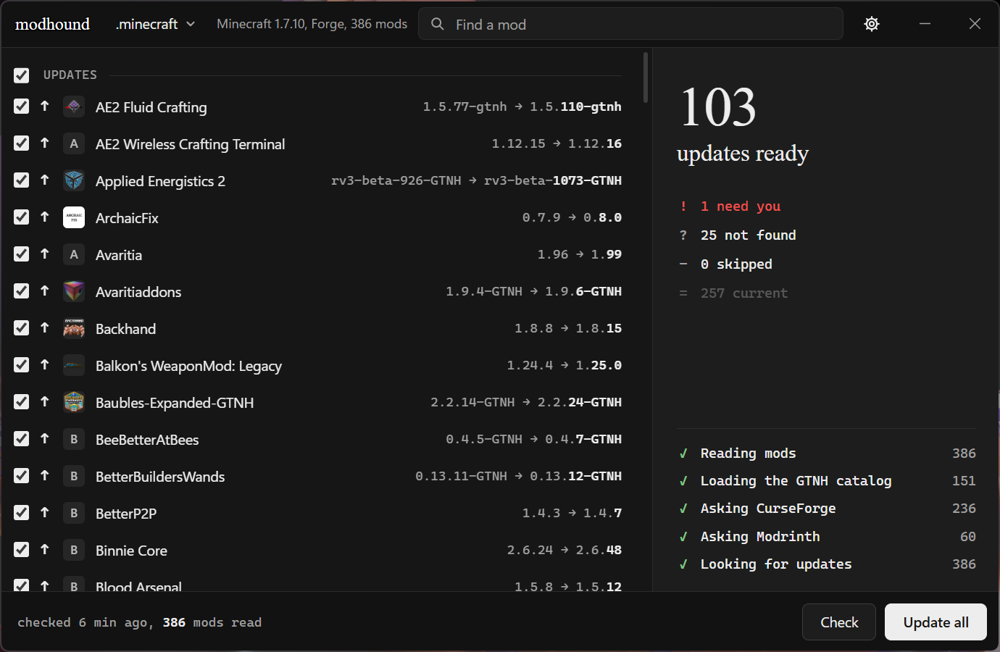

# modhound

Finds and installs mod updates for your Minecraft modpack. Made for my own modpack, which I play on legacy TL from time to time, but works for updating mods in any modpack, as long as it has a folder with mods in it. 

modhound identifies every jar in the `mods` folder by its hash on CurseForge and Modrinth, and GT New Horizons mods by the GTNH asset manifest. It only installs files built for the modpack's Minecraft version and loader, checks each download before replacing the old jar, keeps the previous version of every mod it updates, and writes a report of what was updated. 



Currently supports Forge.

## Usage

1. Download `modhound.exe` from the [latest release](https://github.com/blackkriger/modhound/releases/latest) and run it.
2. modhound opens `%APPDATA%\.minecraft` if it has mods. For another modpack, click **Select folder** at the top and pick its minecraft folder, the one that contains `mods`. 
3. The modpack is checked right away. The list shows:
   - **Updates**: a newer file is available.
   - **Updated**: updated by modhound, the previous version can be restored.
   - **Need you**: an update exists but has to be downloaded by hand.
   - **Not found**: the jar is not on GTNH, CurseForge or Modrinth.
   - **Skipped**: mods you chose not to update.

   The counters on the right filter the list.
4. Click **Update all**, or uncheck mods first to update only the selected ones. Hover a row to update or skip a single mod. Click a row for details and what's new.
5. When it finishes, the report is saved and the updated mods are listed on the right.
6. If you need a specific version of a mod, click a row and then **Select version**: every version built for your Minecraft version is listed, a click on a version shows its changes, and **Install** puts the chosen one in place of the current jar, newer or older. 

## Undo

modhound keeps the previous version of each mod it updates. Updating a mod again replaces the kept version with the one just replaced. Hover an updated mod and click **Undo**, or check several updated mods and click **Undo**, or use **Undo all** after an update. 

## Server

Set **Server** in the settings to keep a server's mods in step with the modpack. Every mod updated in the modpack is then also updated in the server's mods folder, if the server has it. When the server is behind the modpack, the right panel shows how many mods differ and an option to **Sync** them. Server files are backed up and restored by **Undo** together with the modpack. 

**Server** takes either a folder on this computer or a remote server over SFTP:

- `D:\server`: a local server folder. 
- `user@host:/path/to/server` or `sftp://user@host:port/path/to/server`: a remote server. The sign-in uses the key in **SSH key**, by default the first of `id_ed25519`, `id_ecdsa` and `id_rsa` in `%USERPROFILE%\.ssh`. The host must already be in `%USERPROFILE%\.ssh\known_hosts`, so connect to it once with `ssh` first. Keys with a passphrase and PuTTY `.ppk` keys are not supported; convert a `.ppk` key to OpenSSH format with PuTTYgen. Replaced server files are kept in `modhound-backups` next to the server's `mods` folder. 

A local server has to be stopped before updating, because the files of a running server can't be replaced. A remote server can keep running while it is updated, but it has to be restarted afterwards to load the new mods. 

## CurseForge API key

CurseForge lookups need a CurseForge Core API key from https://console.curseforge.com. Enter it in the settings. Without a key, mods hosted only on CurseForge cannot be checked, and the few GTNH mods distributed through CurseForge cannot be downloaded. 

## Settings

Open the settings with the gear at the top. Changes are saved as you make them.

- **CurseForge API key**
- **Server**: a local server folder or a remote server.
- **SSH key**: the key for a remote server.
- **Theme**: System, Light or Dark.
- **Debug mode**: shows the log console and writes it to a file. 

## Files

- `%APPDATA%\modhound`: settings.
- `%LOCALAPPDATA%\modhound`: backups, reports, logs and the cached GTNH catalog.

## Updates

modhound checks for a new release on start. When one is available, **Update to X** appears in the settings under the version.

## Building

Requires Go and Node.js, and the [Wails](https://wails.io) CLI.

```
pwsh ./build.ps1
```

This builds `build/bin/modhound.exe` with the version from `build.ps1` and writes its SHA-256 also. The app icons and `build/modhound.png` are generated with `pwsh ./tools/genicons.ps1`. 